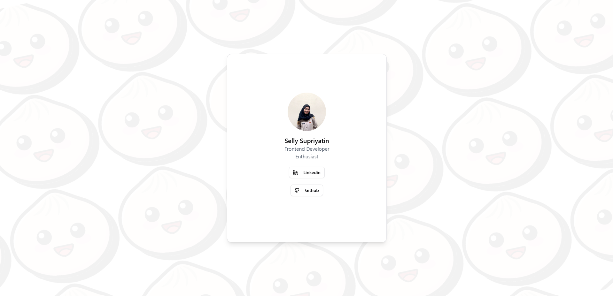
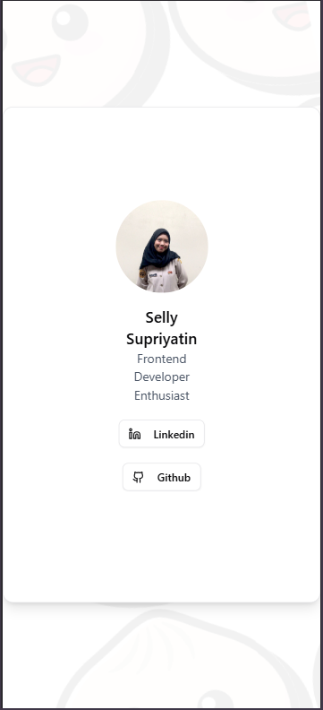

# 🧩 React ProfileCard - Tugas React Part 2

Tugas ini merupakan lanjutan dari project React sebelumnya. Komponen `ProfileCard` menampilkan informasi profil pengguna yang berisi foto, nama, deskripsi singkat, dan tombol link ke sosial media (LinkedIn dan GitHub) dengan icon dari `lucide-react`.

---

## ✨ Fitur Utama

✅ Menggunakan **TailwindCSS** untuk styling  
✅ Menggunakan **Shadcn UI** untuk komponen Card, Avatar, dan Button  
✅ Menampilkan gambar profil asli  
✅ Tombol sosial media aktif dan bisa diklik  
✅ Icon dari lucide-react  
✅ Struktur project rapi dan modular

---

## 🗂️ Struktur Folder

src/
├── components/
│ └── shared/
│ ├── ProfileCard.tsx
│ └── index.ts
├── data/
│ ├── profile.ts
│ └── index.ts
├── interfaces/
│ ├── profile-card.interface.ts
│ └── index.ts
public/
└── assets/
└── images/
└── profile-image.png


---

## 🧱 Teknologi yang Digunakan

- React + TypeScript
- TailwindCSS
- Shadcn UI (Card, Avatar, Button)
- lucide-react (Icon sosial media)
- Bun runtime

---

## 💻 Cara Menjalankan Project

```bash
bun install
bun dev
```
## 📦 Contoh Penggunaan Komponen
```tsx
<ProfileCard
  name={profileData.name}
  description={profileData.description}
  image={profileData.image}
  socialMedia={profileData.socialMedia}
/>
```
---
## 🔗 Link Sosial Media
Tombol sosial media dibuat dinamis berdasarkan data di src/data/profile.ts. Saat diklik, tombol akan membuka link sosial media di tab baru.

---
## 🖼️ Tampilan UI
Screenshot tampilan ProfileCard:
- Web Version


- Mobile Version


---
## 🚀 Kontribusi
Tugas ini dibuat untuk latihan mandiri dalam memahami konsep-komponen React, prop drilling, penggunaan Shadcn UI, dan pemetaan data dengan map().