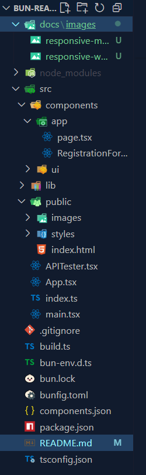
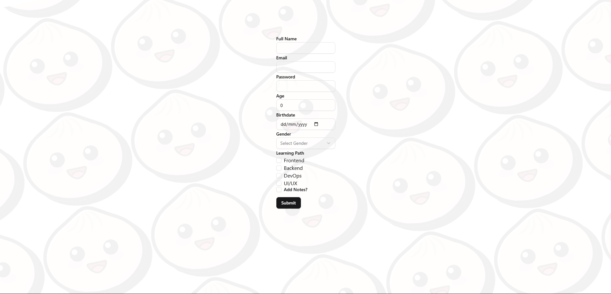
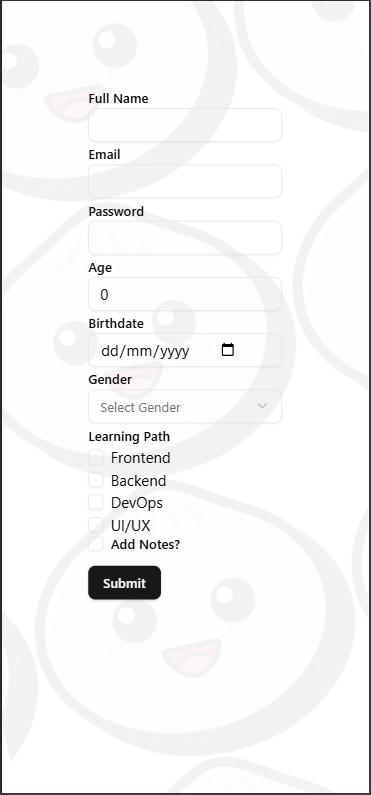

# 🚀 Membuat Registration Form

Komponen ini merupakan form pendaftaran peserta bootcamp yang dibangun menggunakan:

- ⚛️ React + TypeScript
- 🧠 @tanstack/react-form (pengelolaan state form)
- 💄 Shadcn UI (komponen siap pakai)
- 🎨 TailwindCSS (styling responsif)
- 🔔 Sonner (toast notifikasi)

---

## 🧩 Fitur

### ✅ Form Field
- Full Name *(text input)*
- Email *(email input)*
- Password *(password input)*
- Age *(number input)*
- Birthdate *(date input)*
- Gender *(select dropdown: Male / Female)*
- Learning Path *(checkbox multiple: Frontend, Backend, DevOps, UI/UX)*
- Notes *(textarea – muncul hanya jika "Add Notes?" dicentang)*

### ⚙️ Interaktivitas
- `onFocus` dan `onBlur` untuk logging input interaksi
- `onSubmit` menampilkan data peserta yang disubmit
- Conditional rendering untuk bagian "Notes"
- Data peserta ditampilkan di bawah form setelah disubmit
- Toast sukses muncul menggunakan `toast()` dari Sonner

### 📱 Responsif
- Tampilan responsif untuk mobile dan desktop
- Menggunakan `max-w-xl`, `mx-auto`, `space-y-4`, dan utility Tailwind lainnya

---

## 📸 Screenshot

> Simpan gambar hasil di `docs/images/`  
> Contoh path gambar: `docs/images/form-preview.png`



---

## 🛠 Cara Menjalankan

1. Jalankan dev server:
```bash
bun dev
```
2. Buka di browser
```arduino
http://localhost:3000 (ctrl + click)
```
<br>

### 📸 Hasil Tampilan Form
- Tampilan Web



- Tampilan Mobile
