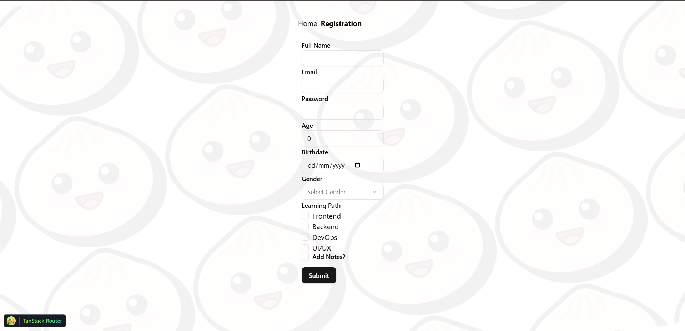
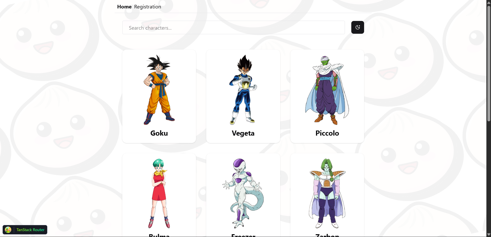
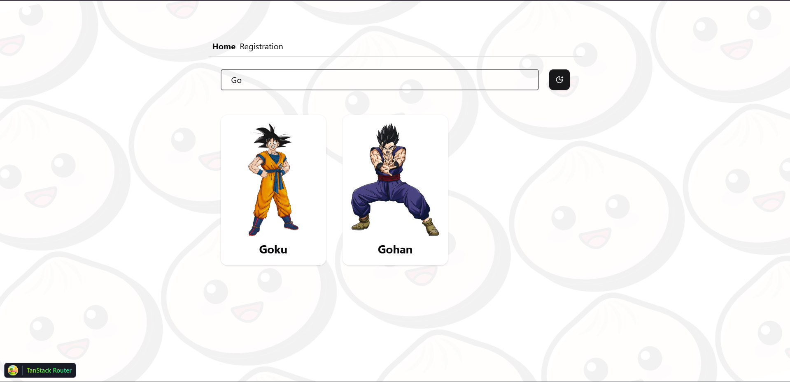

## 🚀 React Part 6 - Dragon Ball App
### 📌 Deskripsi

Project ini dibuat untuk memenuhi Tugas React Part 6.
Aplikasi ini menampilkan halaman Profile dan Characters Dragon Ball dengan fitur Routing, Fetching Data API, Pagination, Table, Skeleton Loading, Error Handling, dan Optional Search & Filter.

### 🛠️ Teknologi yang Digunakan

- React + TypeScript

- Bun

- React Router

- @tanstack/react-query

- @tanstack/react-table

- Shadcn UI

- TilwindCSS

### ⚙️ Setup & Instalasi
- Install dependencies
- bun install
- Tambahkan file .env
```ini
BUN_PUBLIC_BASE_URL=https://dragonball-api.com/api
```


### 🔎Jalankan project
```bash
bun dev
```

### 📖 Fitur Utama
1. Routing

- ``/profile`` → Menampilkan nama, foto, dan deskripsi singkat.

- ``/characters`` → Menampilkan tabel karakter Dragon Ball.

2. Fetching Data (API Dragon Ball)

- Endpoint:
```bash
GET /characters?page=1&limit=10
```
- Pagination menggunakan query ``page`` & ``limit``.

3. TanStack Query + Shadcn Pagination

- Data karakter diambil dengan TanStack Query.

- Pagination diimplementasikan dengan komponen Shadcn.

4. TanStack Table + Shadcn

- Tabel menampilkan Name & Image minimal.

### 📸 Screenshot
- Profile Page


- Characters Page


- Search & Filter

