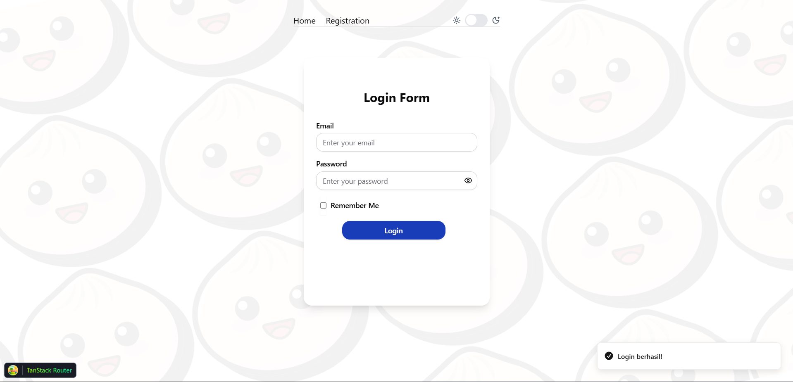
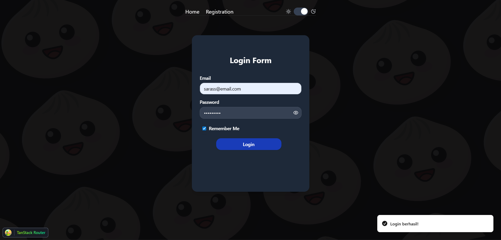

# 🚀 Final Project React - Authentication & Authorization

## 🎯 Tujuan
Project ini dibuat untuk mengintegrasikan sistem **Authentication** dan **Authorization** dari Backend (NestJS Auth JWT) ke dalam aplikasi Frontend menggunakan React.

---

## 🧩 Fitur Utama
✅ **Authentication & Authorization**
- Login dengan backend menggunakan JWT
- Auth Guard → redirect ke `/login` jika user belum login
- State user disimpan dengan **Zustand**

✅ **Routing**
- Menggunakan **Tanstack Router** (File-based Routing)
- Protected Route untuk `/dashboard`

✅ **Form**
- Login form dibuat dengan **Tanstack Form**
- Validasi form sederhana

✅ **Dashboard**
- Fetch data user dari endpoint `GET /api/user`
- Tampilkan data **id, email, role** dalam tabel
- Implementasi **pagination**

---

## 📝 Optional Challenge (Jika diimplementasikan)
- Register Page
- Layout berbeda untuk halaman Auth (login, register) dan Dashboard
- Sidebar pada Dashboard
- CRUD (Create, Read, Update)
- Dark Mode toggle button
- Kolom ID tabel dibuat elipsis + tooltip untuk detail

---

## ⚡️ Tech Stack
- [React + Vite](https://vitejs.dev/)
- [Tanstack Router](https://tanstack.com/router)
- [Tanstack Form](https://tanstack.com/form)
- [Tanstack Query](https://tanstack.com/query)
- [Zustand](https://zustand-demo.pmnd.rs/)
- [Axios](https://axios-http.com/)

---

## 🚀 Cara Menjalankan Project

### 1. Jalankan Backend
Clone repository backend:
```bash
git clone https://github.com/Salmansha08/nest-auth-jwt-starting backend
cd backend
bun install
```
Buat file `.env` di root backend, lalu jalankan:
```bash
bun run start:dev
```
- Backend berjalan di: `http://localhost:3210`
- Swagger API Docs: `http://localhost:3210/api/docs`
<br>

### 2. Jalankan Frontend

Clone repository ini lalu install dependency:
``` bash
bun install
```
Jalankan aplikasi React:

```bash
bun dev
```
Frontend berjalan di: `http://localhost:3000`

---

## 📸 Screenshots
- Light Mode

<br>

- Dark Mode
